# AWX

AWX is the open-source upstream project of Red Hat Ansible Automation Platform. It provides a web-based user interface, REST API, and task engine for managing Ansible playbooks, inventories, and schedules. Essentially, AWX makes it easier to use Ansible in enterprise environments by offering role-based access control, job scheduling, centralized logging, and integration with external authentication providers.


##  Why Use AWX?  

- Centralized management of Ansible Playbooks  
- Role-based access control for teams  
- Real-time job tracking and logging  
- Built-in scheduling for recurring tasks  
- REST API for integrations with CI/CD pipelines

## Table Of Content

[Virtual Machine Setup](#virtual-machine-setup)  

[AWX Installation](#awx-installation)

[Features of Ansible AWX](#features-of-ansible-awx)

[Organization](#organization)  

[Inventory](#inventory)  

[Hosts](#hosts)  

[Credentials](#credentials)  

[Projects](#projects)  

[Templates](#templates)  

[Job Templates](#job-templates)  

[Workflow Templates](#workflow-templates)  

[Manual Approval](#manual-approval) 

[RBAC](#rbac)

### Virtual Machine Setup

1. Create Linux VM with minimum of:-
    - 4 CPU 
    - 8 GB RAM (F4s v2 on Azure)

    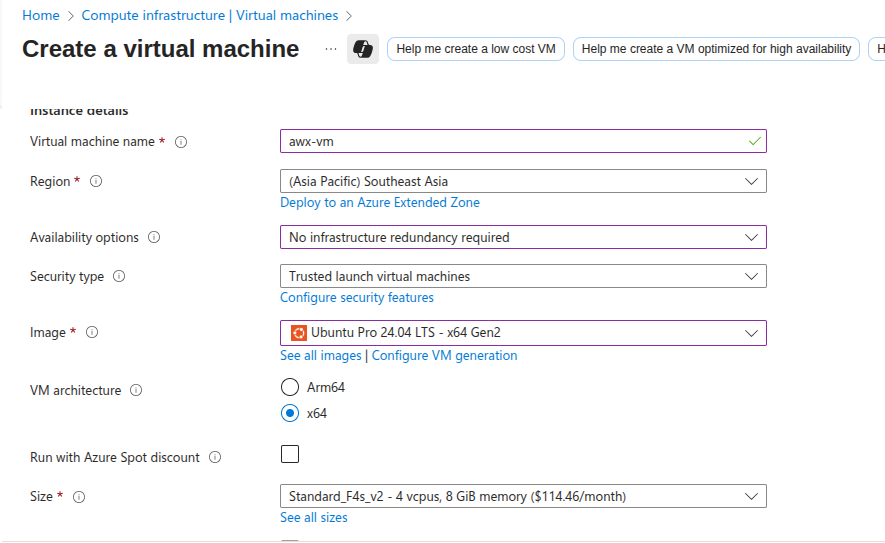


2. Install Required Dependencies:-

- [Kubectl](https://kubernetes.io/docs/tasks/tools/install-kubectl-linux/)  
- [Docker (Make docker sudo user)](https://docs.docker.com/engine/install/ubuntu/)  
- [Minikube](https://minikube.sigs.k8s.io/docs/start/?arch=%2Flinux%2Fx86-64%2Fstable%2Fbinary+download) 

### AWX Installation

1. Start minikube:

   *Starts a single-node Kubernetes cluster on your VM with Ingress enabled and allocates the needed CPU/RAM.*


    ```
    minikube start --cpus=4 --memory=6g --addons=ingress
    ```

2. make dir minikube:

    *Creates and enters a folder to keep your Kustomize and AWX manifests together.*
    ```
    mkdir minikube
    cd minikube
    ```

3. make a aliase:

    *Points `kubectl` to minikube’s built-in context so all commands target this cluster.*


    ```
    alias kubectl="minikube kubectl --"
    ```


4. Create Kustomization file:

    *Defines the AWX Operator deployment from a specific tag and the target namespace (`awx`).*

    ```
    vim kustomization.yaml
    ```
    Use latest tags from https://github.com/ansible/awx-operator/tags
    ```
    ---
    apiVersion: kustomize.config.k8s.io/v1beta1
    kind: Kustomization
    resources:
      - github.com/ansible/awx-operator/config/default?ref=2.19.1
    images:
      - name: quay.io/ansible/awx-operator
        newTag: 2.19.1
    namespace: awx
    ```
5. Apply the Kustomization file

    *Installs the AWX Operator (CRDs, controller, etc.) into the cluster.*

    ```
    kubectl apply -k .
    ```
6. Create AWX Server File

    *Declares an AWX instance that the operator will reconcile and expose via NodePort.*

    ```
    vim awx-server.yaml
    ```

    ```
    ---
    apiVersion: awx.ansible.com/v1beta1
    kind: AWX
    metadata:
      name: awx-server
    spec:
      service_type: nodeport
    ```
7. Edit Kustomization File

    *Includes your `awx-server.yaml` in the same Kustomize build so it applies with the operator.*


    ```
    vim kustomization.yaml
    ```
    add "- awx-server.yaml" in file
    ```
    ---
    apiVersion: kustomize.config.k8s.io/v1beta1
    kind: Kustomization
    resources:
      - github.com/ansible/awx-operator/config/default?ref=2.19.1
      - awx-server.yaml
    images:
      - name: quay.io/ansible/awx-operator
        newTag: 2.19.1
    namespace: awx
    ```

8. Re-apply Kustomization

    *Triggers the operator to create the AWX pods, services, and database based on the CR.*

    ```
    kubectl apply -k .
    ```

9. check for all svc and pods (usually takes few minutes to get all these resources).


    ```
    kubectl get svc -n awx
    NAME                                              TYPE        CLUSTER-IP      EXTERNAL-IP   PORT(S)        AGE
    awx-operator-controller-manager-metrics-service   ClusterIP   10.110.54.158   <none>        8443/TCP       89m
    awx-server-postgres-15                            ClusterIP   None            <none>        5432/TCP       88m
    awx-server-service                                NodePort    10.99.30.190    <none>        80:31656/TCP   88m


    kubectl get pods -n awx
    NAME                                               READY   STATUS      RESTARTS       AGE
    awx-operator-controller-manager-58b7c97f4b-tbxqh   2/2     Running     2 (31m ago)    89m
    awx-server-migration-24.6.1-h46m9                  0/1     Completed   0              86m
    awx-server-postgres-15-0                           1/1     Running     1 (30m ago)    88m
    awx-server-task-6f8dfc7cb5-5m7n8                   4/4     Running     4 (30m ago)    88m
    awx-server-web-6d4fdb8f87-rhzc7                    3/3     Running     3 (105s ago)   88m
    ```

10. Expose to Internet using port forwarding

     *Forwards VM’s external port to the AWX service (binding to 0.0.0.0 so it’s reachable remotely).*


    ```
    kubectl port-forward -n awx service/awx-server-service --address 0.0.0.0 <awx-server-service-port(31656)>:80
    ```
     *Open the UI:*  

    ```
    http://<vm-ip>:<awx-server-service-port>/
    ```

11. Allow < awx-server-service-port > in your Network Security Group
    

12. Get Token Password

     *Reads the admin secret from Kubernetes and decodes the base64 password.*

    ```
    kubectl get secret awx-server-admin-password -o jsonpath="{.data.password}" -n awx | base64 -d; echo
    ```
13. Login Details

     *Use the default admin user with the retrieved password to access the web UI.*

    ```
    username: admin
    password: <token>
    ```

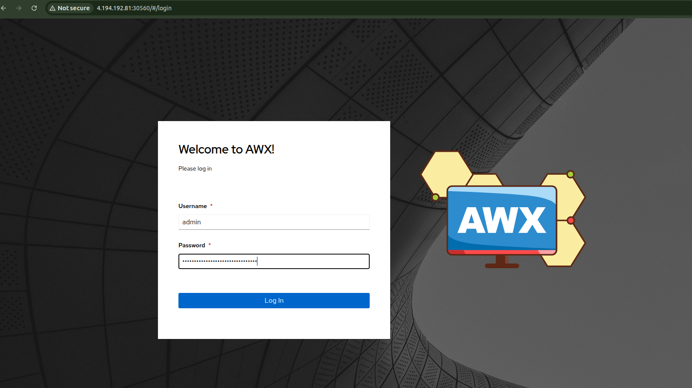

## Features of Ansible AWX

### Organization

An **Organization** in AWX is the top-level entity that groups together users, teams, inventories, credentials, and projects.  
It helps in logically separating resources and applying **role-based access control (RBAC)**, making it easier to manage multiple teams or environments (e.g., Dev, Test, Prod).

<!-- 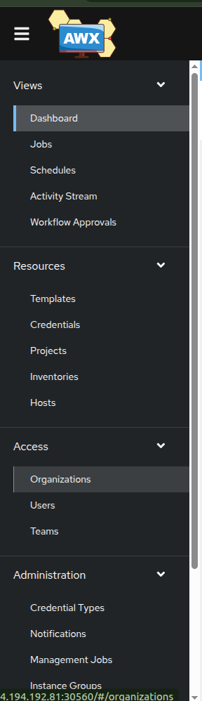 -->

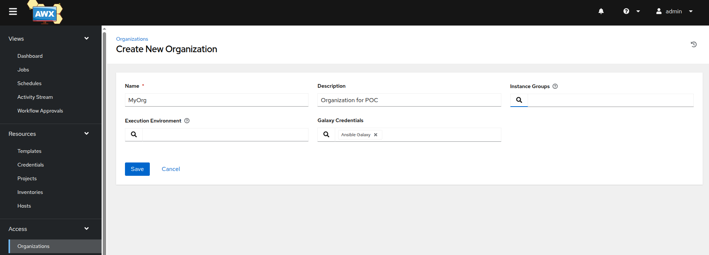


### Inventory

**Inventory** is a collection of hosts which will be a target for Ansible playbooks. Hosts can be created individually or in the group.

AWX supports several methods for inventory creation, including static, dynamic and smart inventory options. 

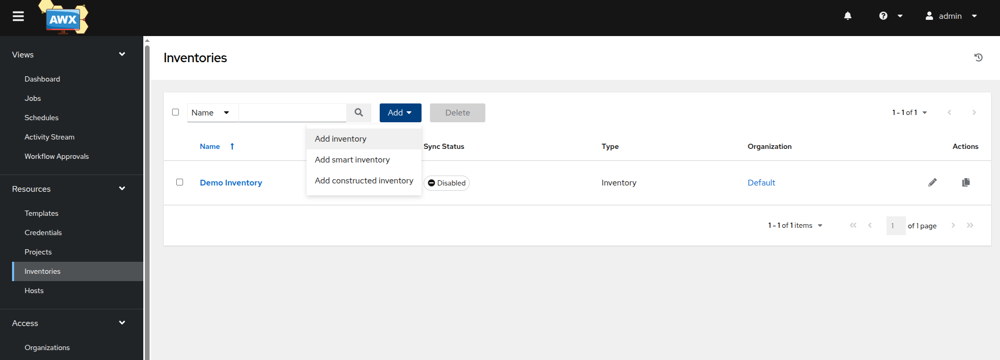

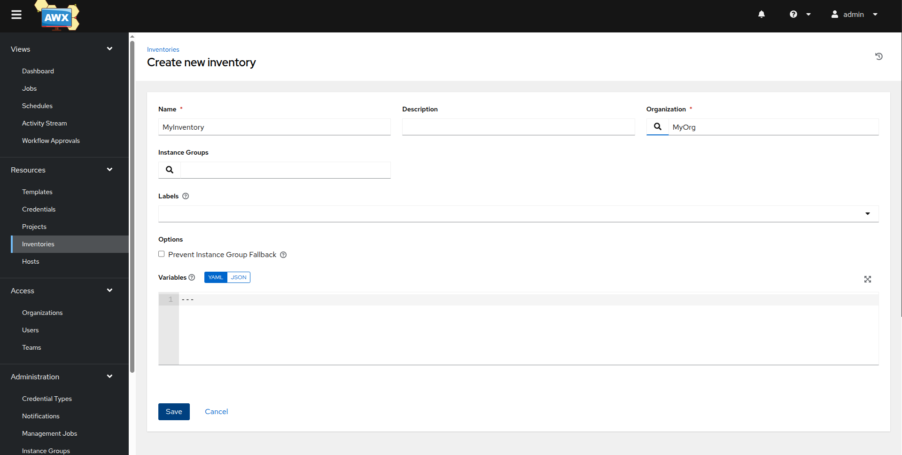

#### Hosts


**Hosts** in AWX represent the individual machines or nodes that Ansible manages.  
They are defined inside an **Inventory** and can be physical servers, VMs, containers, or cloud instances.  

- In the **Name** field, enter a valid **DNS name** (e.g., `web01.prod.example.com`) or an **IP address** (e.g., `192.168.1.10`).  

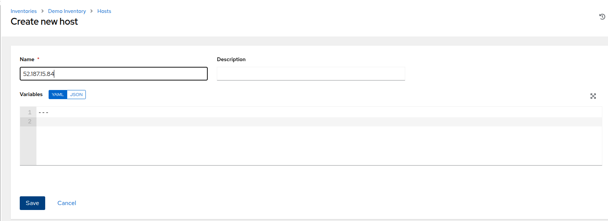


### Credentials

AWX uses **credentials** for authentication of aimed workloads. Running Jobs on machines, synchronizing with inventories, and importing project contents from a version control system are some of the examples from these workloads.

AWX provides an encryption option for storing the sensitive credentials (SSH passwords, SSH private keys, API files for service accounts, etc.). Additionally, AWX supports multiple credential types such as Gcp, Aws, Azure, and some others are shown in the screenshot below.

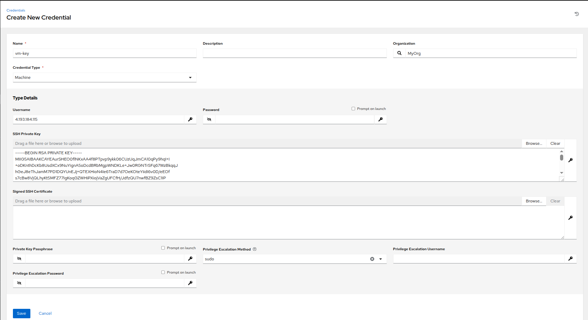


### Projects  

Basically, **Projects** represent a collection of Ansible Playbooks. Projects containing the Playbooks can be updated periodically by Source Control applications, such as Git, Subversion, Mercurial etc. Also, Playbooks can be put in the local filesystem that AWX installed if wished.

In our environment we use Source Control as a repository of Ansible playbooks. We use git@bitbucket. To do so, you need to create access key on bitbucket and use it in AWX. All of the credentials are kept securely in AWX. Keys are encrypted while stored, and they can not be retrieved even from AWX’ s database. 

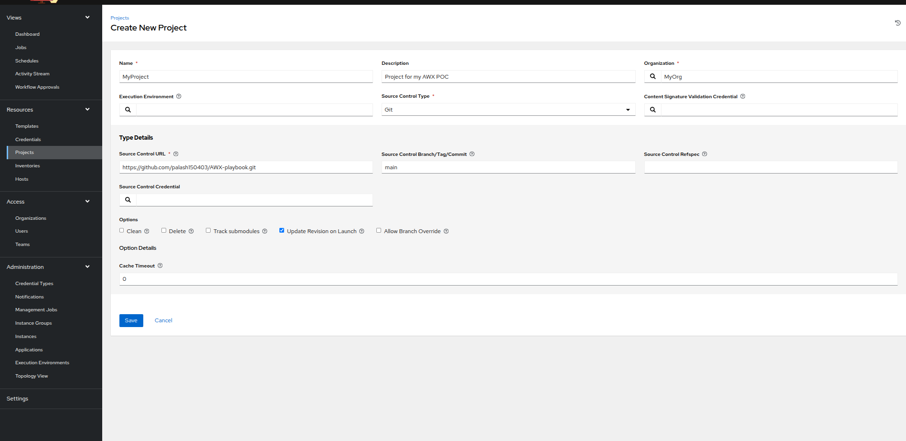

**How to verify if code was pulled successfully from GitHub:**  
1. Go to **Projects** in AWX UI.  
2. Select your project → Click **Sync** (⟳ icon).  
3. Check the **Last Job Status** column.  
   - ✅ **Successful** → Code was pulled successfully.  
   - ❌ **Failed** → Click on the job log to see errors (e.g., invalid Git URL, authentication issues).  
4. Navigate to **Jobs** → You will see a **Project Sync Job** created for each pull. Open it to view detailed logs of the SCM update.  
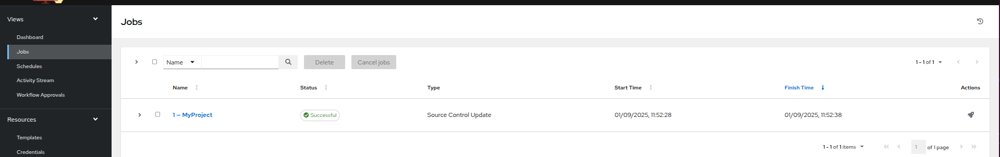

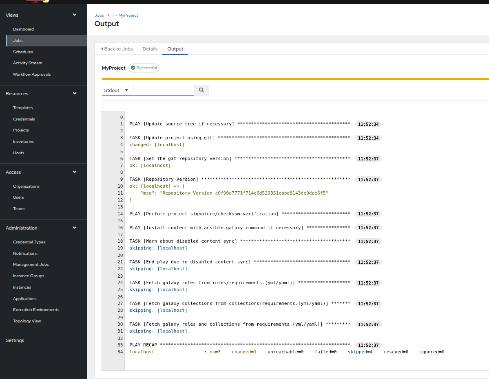
### Templates
Templates in AWX are blueprints that define how automation should be executed.  
They specify what playbook to run, on which inventory, with which credentials, and any extra parameters.  

---
### Job Templates


the **Job template** in AWX, consists of configurations required for Ansible jobs. Job template provides ready to use Ansible jobs for Awx users. When the user launches a Job template, AWX automatically runs a single Job for each launched job template. Therefore, job templates are useful to execute the same job many times and create similar jobs from one fundamental job. 

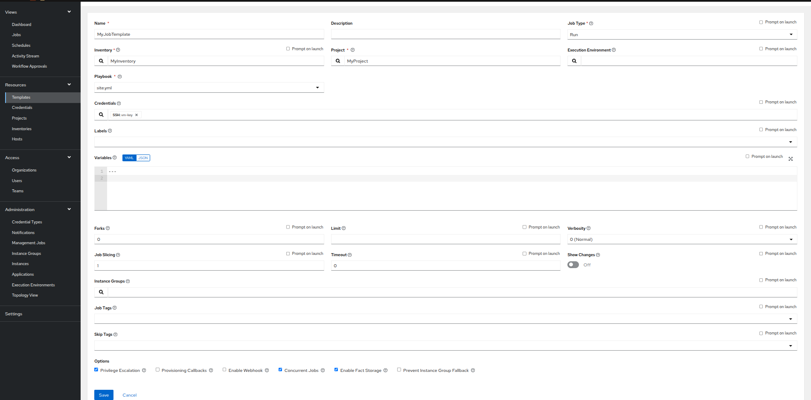

- Click on Launch to run the play book.

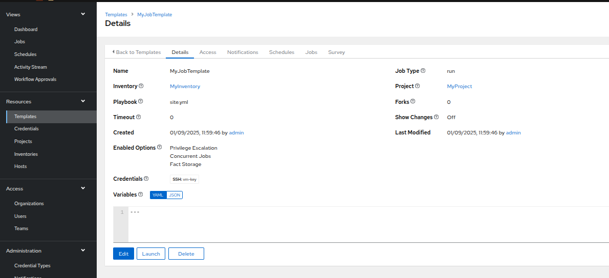

- check for logs in details section.

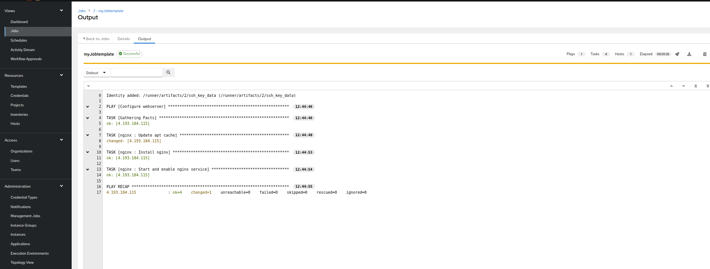
### Workflow Templates

Workflow Templates define **chains of jobs** that run in a specific order.  
They allow complex automation scenarios where multiple Job Templates are linked together. Supports **conditional execution** (success/failure branching). Combine multiple Job Templates and Projects into a single workflow. Useful for **CI/CD pipelines**, multi-step provisioning, or remediation workflows. 

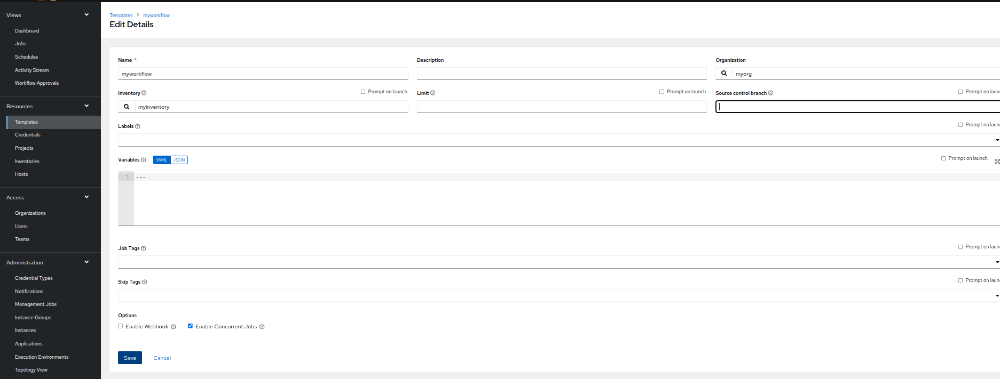

- once created a Template you will see this vizualizer.

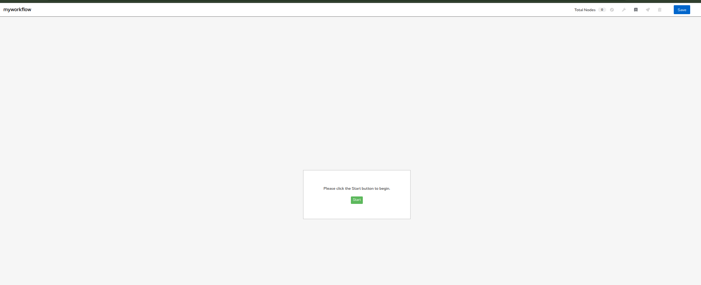

- Add the first Job Template in the Workflow.

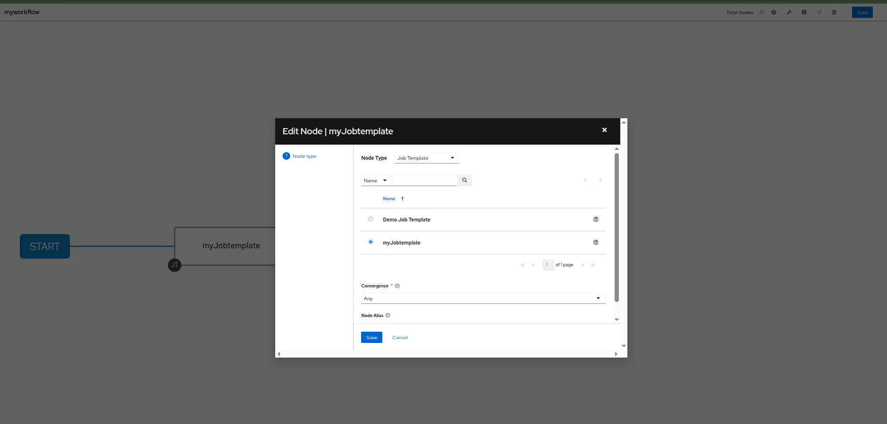

- Click on **+** to add next job.

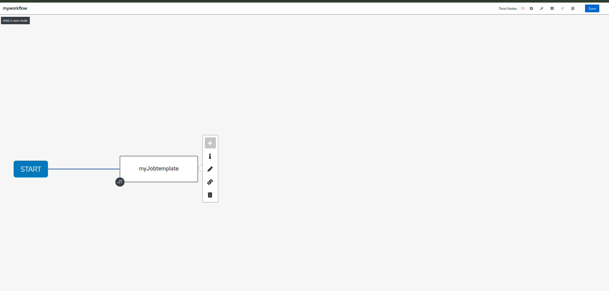

- Select condition to trigger next job.

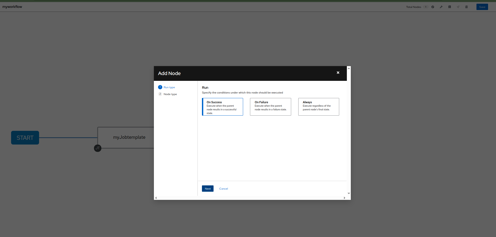

#### Manual Approval
**Manual Approval** is a feature in AWX **Workflow Job Templates** that allows you to insert a checkpoint before moving to the next job in the workflow.  
It ensures that human intervention is required before execution continues — useful for production changes or sensitive tasks.  

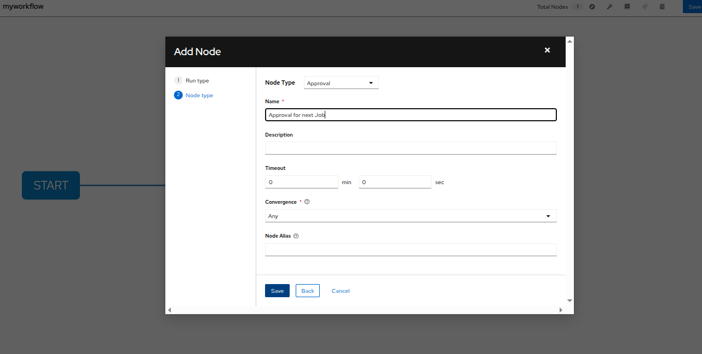
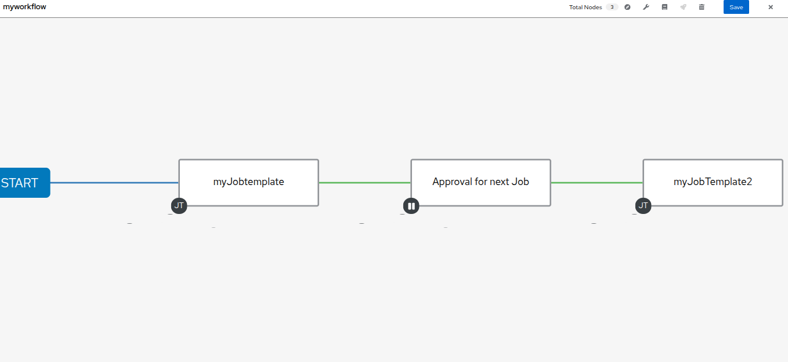
<!-- 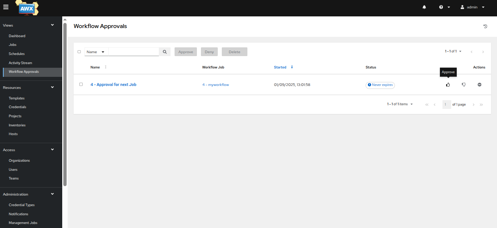 -->
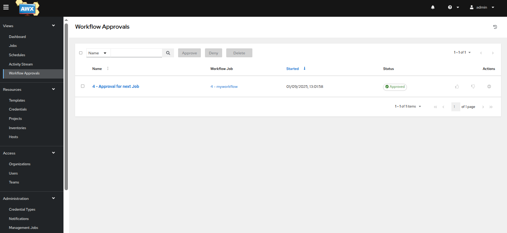

- Final run of the workflow template.

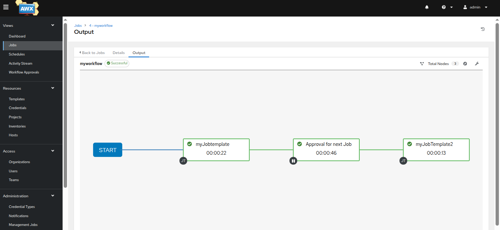

### RBAC
**Role-Based Access Control (RBAC)** in AWX lets you grant precise permissions to **users** or **teams** over specific **resources** (Organizations, Projects, Inventories, Credentials, Job/Workflow Templates).  
Instead of sharing keys or full admin rights, you assign narrowly scoped roles like **Use**, **Execute**, **Update**, or **Admin** on each resource.

**Common role scopes (examples):**
- **Organization:** Admin, Member, Auditor
- **Project:** Admin, Use, Update, Read
- **Inventory:** Admin, Use, Update, Read
- **Credential:** Admin, Use, Read
- **Job/Workflow Template:** Admin, Execute, Read

#### Create a User

- Click on Add and create user according to your use case.
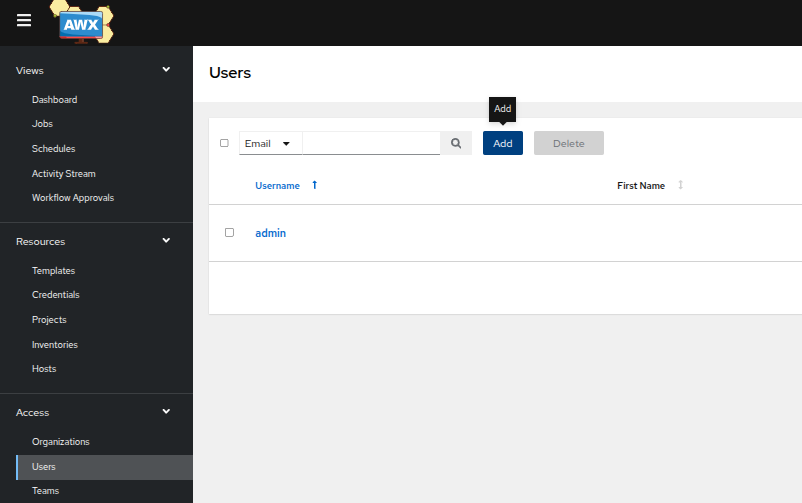
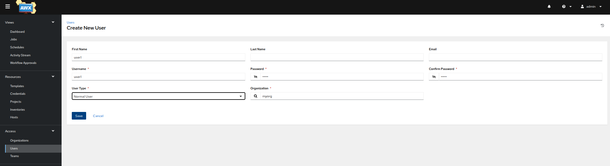

#### Assign Roles

- Click add in role section

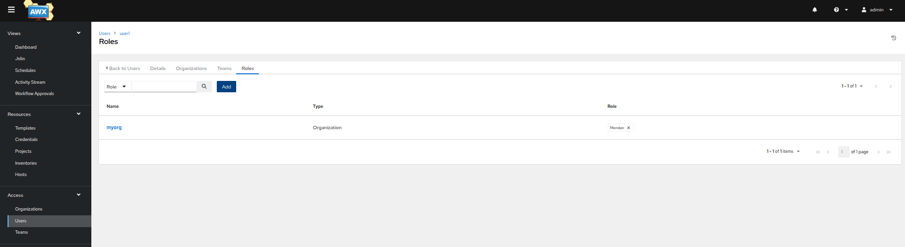

- Select the scope to assign role

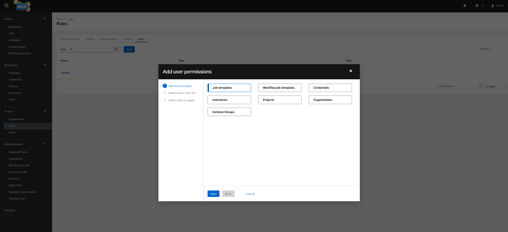

- Select the permission to be assigned to the user

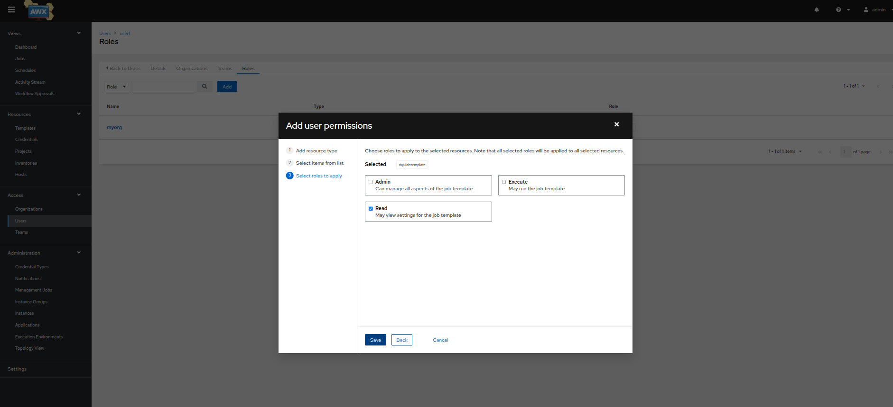

## Refs

https://www.youtube.com/watch?v=n3SzwzbxfRE
https://www.linuxtechi.com/install-ansible-awx-on-ubuntu/
https://bobcares.com/blog/setup-ansible-awx-on-ubuntu/
https://ansible.readthedocs.io/projects/awx-operator/en/latest/installation/basic-install.html