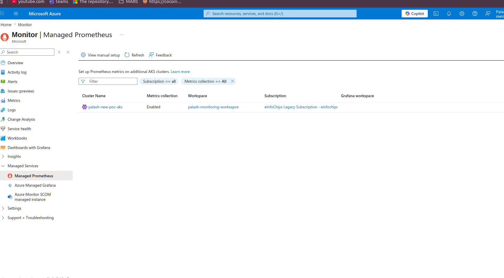
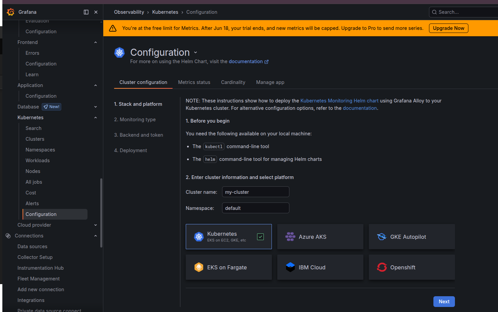
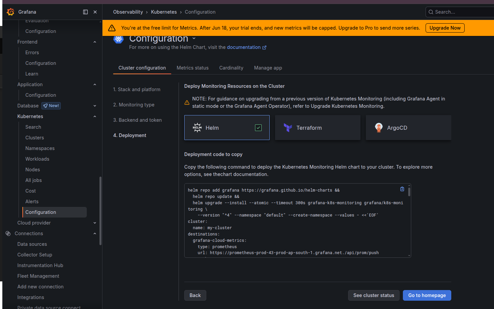
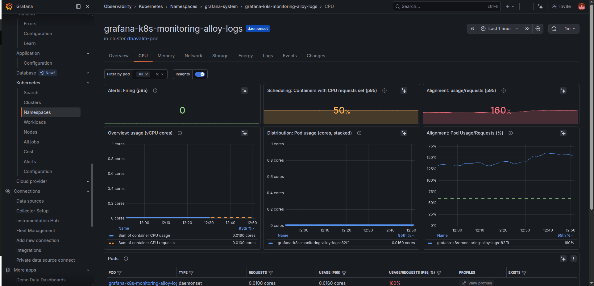
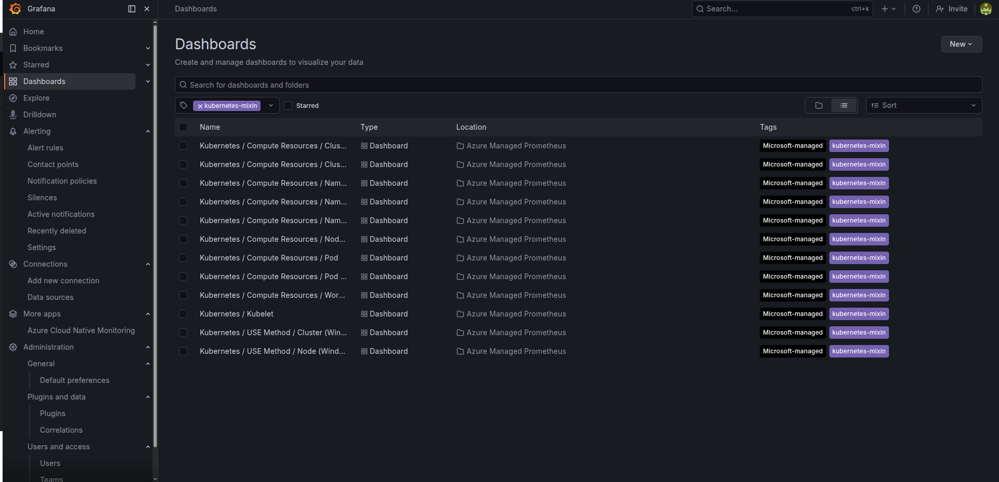
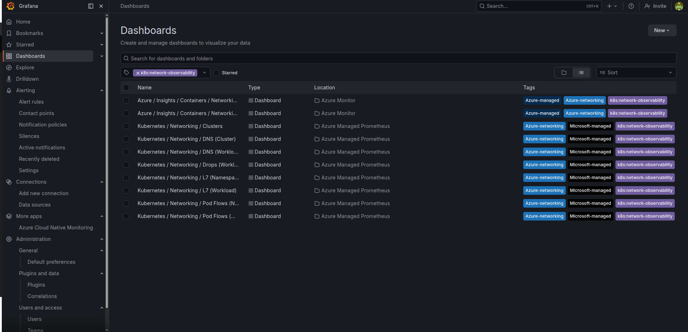

# Grafana Cloud vs Azure Managed Grafana

This comprehensive guide covers setup and feature comparison for both Grafana Cloud and Azure Managed Grafana, including Kubernetes monitoring integration and observability best practices.

## Table of Contents

1. [Azure Managed Grafana Setup](#azure-managed-grafana-setup)
2. [Grafana Cloud Setup](#grafana-cloud-setup)
3. [Built-in Dashboard Metrics Comparison by Resource Level](#built-in-dashboard-metrics-comparison-by-resource-level)
   - [Resource Level Coverage Summary](#resource-level-coverage-summary)
   - [Cluster Level](#cluster-level)
   - [Namespace Level](#namespace-level)
   - [Node Level](#node-level)
   - [Workload Level](#workload-level)
   - [Pod Level](#pod-level)
   - [Container Level](#container-level)
   - [Kubelet Level](#kubelet-level-azure-managed-grafana-only)
   - [Dedicated Networking Dashboards](#dedicated-networking-dashboards)
   - [Overall Metric Category Winner](#overall-metric-category-winner)
4. [Feature Comparison Matrix](#feature-comparison-matrix)
5. [Grafana Cloud — Key Features (Grafana 13)](#grafana-cloud--key-features-grafana-13)
6. [References](#references)

---

# Azure Managed Grafana Setup

## AKS Monitoring with Azure Managed Grafana and Prometheus

This guide describes the end-to-end steps for preparing an AKS cluster, enabling Azure Monitor Metrics with managed Prometheus, and connecting Azure Managed Grafana to the monitoring workspace.

## Prerequisites

- Azure CLI installed and logged in: `az login`
- `kubectl` configured
- Permission to create resources in the target subscription and resource group
- A Log Analytics / Azure Monitor workspace available
- An Azure Managed Grafana workspace available or provisioned

## Step 1: Create the AKS cluster

```bash
az aks create \
  --resource-group sa1_test_eic_PalashGajjar \
  --name palash-new-poc-aks \
  --node-count 2 \
  --node-vm-size Standard_B2ps_v2 \
  --enable-managed-identity \
  --generate-ssh-keys \
  --enable-encryption-at-host \
  --tags "Resource Owner=palash.gajjar@einfochips.com" "Resource Group Owner=palash.gajjar@einfochips.com" \
  --nodepool-tags "Resource Owner=palash.gajjar@einfochips.com" "Resource Group Owner=palash.gajjar@einfochips.com"
```

Notes:

- `--enable-managed-identity` ensures AKS uses a managed identity for Azure resource operations.
- `--enable-encryption-at-host` adds encryption at the node host level.

## Step 2: Connect kubectl to the cluster

```bash
az aks get-credentials \
  --resource-group sa1_test_eic_PalashGajjar \
  --name palash-new-poc-aks \
  --overwrite-existing
```

Verify cluster access:

```bash
kubectl get nodes
```

## Step 3: Validate the AKS identity

```bash
az aks show \
  --resource-group sa1_test_eic_PalashGajjar \
  --name palash-new-poc-aks \
  --query identity \
  -o json
```

If the cluster is not already using a managed identity, update it:

```bash
az aks update \
  --resource-group sa1_test_eic_PalashGajjar \
  --name palash-new-poc-aks \
  --enable-managed-identity
```

## Step 4: Create or locate the Azure Monitor workspace

If you do not already have a workspace, create one:

```bash
az monitor log-analytics workspace create \
  --resource-group sa1_test_eic_PalashGajjar \
  --workspace-name palash-monitoring-workspace
```

Get the workspace resource ID:

```bash
az monitor log-analytics workspace show \
  --resource-group sa1_test_eic_PalashGajjar \
  --workspace-name palash-monitoring-workspace \
  --query id \
  -o tsv
```

If you are using an Azure Monitor account workspace, you can alternatively use:

```bash
az monitor account show \
  --name palash-monitoring-worksapce \
  --resource-group sa1_test_eic_palashgajjar \
  --query id \
  -o tsv
```

## Step 5: Enable Azure Monitor Metrics and Prometheus integration

```bash
az aks update \
  --resource-group sa1_test_eic_PalashGajjar \
  --name palash-new-poc-aks \
  --enable-azure-monitor-metrics \
  --azure-monitor-workspace-resource-id /subscriptions/664b6097-19f2-42a3-be95-a4a6b4069f6b/resourceGroups/sa1_test_eic_PalashGajjar/providers/microsoft.monitor/accounts/palash-monitoring-worksapce
```

This command enables Azure Monitor Metrics for Prometheus integration on the AKS cluster. It deploys the managed Prometheus collector components under `kube-system`.

## Step 6: Verify Azure Monitor managed Prometheus pods

```bash
kubectl get pods -n kube-system | grep ama-metrics
```

Expected pods:

```text
ama-metrics-7df8bb7c9c-djv2j                    2/2     Running   0              7m24s
ama-metrics-7df8bb7c9c-m7ht6                    2/2     Running   0              7m24s
ama-metrics-ksm-7c6789756d-fq6zl                1/1     Running   0              7m24s
ama-metrics-node-24qz9                          2/2     Running   0              7m24s
ama-metrics-node-gxbqw                          2/2     Running   0              7m24s
ama-metrics-operator-targets-6668577c85-njs4k   2/2     Running   3 (5m9s ago)   7m24s
```

If you need to troubleshoot collector behavior:

```bash
kubectl logs -n kube-system -l rsName=ama-metrics --container prometheus-collector | tail -50
```

## Step 7: Create or verify the Azure Managed Grafana workspace

If not already created, provision a Grafana workspace:

```bash
az grafana create \
  --name palash-grafana-poc \
  --resource-group sa1_test_eic_PalashGajjar \
  --location eastus \
  --sku Standard \
  --identity-type SystemAssigned
```

Get the Grafana workspace principal ID:

```bash
az grafana show \
  --name palash-grafana-poc \
  --resource-group sa1_test_eic_PalashGajjar \
  --query identity.principalId \
  -o tsv
```

## Step 8: Grant Grafana access to the monitoring workspace

```bash
az role assignment create \
  --assignee <grafana-principal-id> \
  --role "Monitoring Data Reader" \
  --scope /subscriptions/664b6097-19f2-42a3-be95-a4a6b4069f6b/resourceGroups/sa1_test_eic_palashgajjar/providers/microsoft.monitor/accounts/palash-monitoring-worksapce
```

Replace `<grafana-principal-id>` with the actual principal ID from the previous step.

## Step 9: Configure Azure Managed Grafana data sources

1. Open the Azure Managed Grafana workspace in the Azure Portal.
2. Go to **Data sources**.
3. Add **Azure Monitor** or **Azure Data Explorer** depending on your data source.
4. Select the managed identity and the linked workspace.
5. Add dashboards and panels using Prometheus metrics from AKS.

## Step 10: Validate dashboards and metrics

- Confirm that Prometheus metrics are ingested through Azure Monitor.
- Build a Grafana panel using the managed Prometheus source.
- Verify that AKS health, node metrics, and container metrics are visible in Grafana.



## Notes

- Azure Managed Grafana uses Entra ID authentication and does not expose full Grafana server admin controls.
- Use Standard tier if you need Private Link, managed private endpoints, or deterministic outbound IPs.
- Ensure all resource IDs and resource group names match your environment.

# Grafana Cloud Setup

## Kubernetes Monitoring setup

To set up Kubernetes Monitoring in Grafana Cloud, use the built-in setup guide:

1. Go to **Connections > Collector Setup** and search for **Kubernetes**.
2. Select **Kubernetes Monitoring** — this walks you through activating the feature.



3. You'll get a generated Helm chart command to deploy Grafana Alloy on your cluster, which ships metrics, logs, and events automatically.



## Grafana Cloud Kubernetes Monitoring pod roles

These pods are part of the Grafana Alloy stack deployed on your EKS cluster for Grafana Cloud Kubernetes monitoring.

- `beyla-k8s-cache-...` — Kubernetes resource cache for Alloy. It watches API objects and keeps cluster metadata available for other Alloy components.
- `grafana-k8s-monitoring-alloy-operator-...` — The Alloy operator that manages deployment lifecycle, reconciles configuration, and ensures Alloy components are running.
- `grafana-k8s-monitoring-alloy-singleton-...` — A single control pod for cluster-level coordination and central Alloy status/config handling.
- `grafana-k8s-monitoring-alloy-receiver-...` — Ingests telemetry from Alloy collectors and forwards metrics/logs/events to Grafana Cloud.
- `grafana-k8s-monitoring-alloy-metrics-0` — The main metrics collector that scrapes Prometheus-style metrics and ships them to Grafana Cloud.
- `grafana-k8s-monitoring-alloy-logs-...` — Collects logs from the cluster and forwards them into Grafana Cloud logging.
- `grafana-k8s-monitoring-alloy-profiles-...` — Collects profiling data from the cluster for continuous profiling support.
- `grafana-k8s-monitoring-kube-state-metrics-...` — Exports Kubernetes control-plane state metrics such as pod/deployment counts, resource requests, and object health.
- `grafana-k8s-monitoring-node-exporter-...` — Collects host/node metrics like CPU, memory, disk, and network usage.
- `grafana-k8s-monitoring-kepler-...` — Collects granular node and container resource usage metrics, often used for efficiency and utilization analysis.
- `grafana-k8s-monitoring-opencost-...` — Collects cost and usage data for cloud cost monitoring and chargeback insights.
- `grafana-k8s-monitoring-k8s-manifest-tail-...` — Watches manifest/config changes to keep Alloy deployment config in sync.

This setup matches the Grafana Cloud Kubernetes monitoring flow: deploy Grafana Alloy, collect cluster telemetry, and stream it into Grafana Cloud for dashboards and alerts.

## Grafana Native Kubernetes Monitoring Experience

The Grafana Cloud Kubernetes monitoring experience is built as a unified drill-down workflow from cluster to workload.

- Clusters → Namespaces → Workloads → Nodes → All Jobs — all connected in one navigation flow
- Within each workload you get tabs for **Overview, CPU, Memory, Network, Storage, Energy, Logs, Events, Changes**
- **Per-pod filtering** is available inline on the dashboard
- **Scheduling & Alignment panels** show CPU request percentage and usage vs request alignment
- **Right-sizing intelligence** is built in with p95 usage vs requests comparisons
- **AI Insights toggle** is available per workload
- **Profiles tab** exposes Pyroscope / continuous profiling data
- **Cost** is surfaced in the sidebar for cluster and workload views



## Azure Managed Grafana Kubernetes Monitoring Experience

Azure Managed Grafana with Azure Managed Prometheus exposes Kubernetes telemetry through separate dashboards rather than one cohesive drill-down path.


### Complete Pre-built Azure Managed Grafana K8s Dashboards

### Group 1 — Compute Resources (`kubernetes-mixin` tag)
From Image 1, filtered by `kubernetes-mixin`:

| Dashboard | Location |
|---|---|
| Kubernetes / Compute Resources / Cluster | Azure Managed Prometheus |
| Kubernetes / Compute Resources / Cluster (Windows) | Azure Managed Prometheus |
| Kubernetes / Compute Resources / Namespace (Pods) | Azure Managed Prometheus |
| Kubernetes / Compute Resources / Namespace (Workloads) | Azure Managed Prometheus |
| Kubernetes / Compute Resources / Namespace (Windows) | Azure Managed Prometheus |
| Kubernetes / Compute Resources / Node (Pods) | Azure Managed Prometheus |
| Kubernetes / Compute Resources / Pod | Azure Managed Prometheus |
| Kubernetes / Compute Resources / Pod (Windows) | Azure Managed Prometheus |
| Kubernetes / Compute Resources / Workload | Azure Managed Prometheus |
| Kubernetes / Kubelet | Azure Managed Prometheus |
| Kubernetes / USE Method / Cluster (Windows) | Azure Managed Prometheus |
| Kubernetes / USE Method / Node (Windows) | Azure Managed Prometheus |


### Group 2 — Networking (`k8s:network-observability` tag)
From Image 2, filtered by `k8s:network-observability`:

| Dashboard | Location |
|---|---|
| Azure / Insights / Containers / Networking (v1) | Azure Monitor |
| Azure / Insights / Containers / Networking (v2) | Azure Monitor |
| Kubernetes / Networking / Clusters | Azure Managed Prometheus |
| Kubernetes / Networking / DNS (Cluster) | Azure Managed Prometheus |
| Kubernetes / Networking / DNS (Workload) | Azure Managed Prometheus |
| Kubernetes / Networking / Drops (Workload) | Azure Managed Prometheus |
| Kubernetes / Networking / L7 (Namespace) | Azure Managed Prometheus |
| Kubernetes / Networking / L7 (Workload) | Azure Managed Prometheus |
| Kubernetes / Networking / Pod Flows (Namespace) | Azure Managed Prometheus |
| Kubernetes / Networking / Pod Flows (Workload) | Azure Managed Prometheus |




---

# Built-in Dashboard Metrics Comparison by Resource Level

**Legend:** ✅ Available | ❌ Not Available | ⚠️ Partial / indirect

This section provides a detailed metric-by-metric comparison of the built-in Kubernetes monitoring dashboards in Azure Managed Grafana (via Azure Managed Prometheus) and Grafana Cloud across all resource levels.

## Resource Level Coverage Summary

| Resource Level | Azure Managed Grafana Dashboards | Grafana Cloud Dashboards |
|---|---|---|
| **Cluster** | Kubernetes / Compute Resources / Cluster | Cluster Level (CPU, Memory, GPU, Network, Storage, Energy) |
| **Namespace** | Kubernetes / Compute Resources / Namespace (Pods + Workloads) | Namespace Level (CPU, Memory, Network, Storage) |
| **Node** | Kubernetes / Compute Resources / Node (Pods) | Node Level (CPU, Memory, GPU, Network, Storage, Energy) |
| **Workload** | Kubernetes / Compute Resources / Workload | Workload Level (CPU, Memory, GPU, Network, Storage, Energy) |
| **Pod** | Kubernetes / Compute Resources / Pod | Pod Level (CPU, Memory, Network, Storage, Energy) |
| **Container** | ❌ No dedicated dashboard | ✅ Container Optimization (CPU, Memory, Cost, Prediction, Stability) |
| **Kubelet** | ✅ Kubernetes / Kubelet | ❌ No dedicated dashboard |
| **Network — Pod Flows** | ✅ Workload + Namespace | ❌ Not pre-built |
| **Network — L7 (HTTP/Kafka)** | ✅ Workload + Namespace | ❌ Not pre-built |
| **Network — DNS** | ✅ Cluster + Workload | ❌ Not pre-built |
| **Network — Drops** | ✅ Workload level | ❌ Not pre-built |
| **Network — Fleet/Clusters** | ✅ Multi-cluster fleet view | ❌ Not pre-built |
| **Azure Flow Logs / Topology** | ✅ Analytics Tier dashboard | ❌ Not applicable |

---

## Cluster Level

### CPU

| Metric / Parameter | Azure Managed Grafana | Grafana Cloud |
|---|:---:|:---:|
| CPU Utilisation (%) | ✅ | ✅ |
| CPU Requests Commitment | ✅ | ✅ Efficiency: requests/capacity (p95) |
| CPU Limits Commitment | ✅ | ⚠️ Sum of limits shown |
| CPU Usage by Namespace (vCPU cores) | ✅ | ✅ Overview + by Namespace |
| CPU Quota table (Usage, Requests%, Limits%) | ✅ Per Namespace | ⚠️ Separate panels |
| Efficiency: usage/capacity (p95) | ❌ | ✅ |
| Efficiency: usage/requests (p95) | ❌ | ✅ |
| Physical cluster capacity | ❌ | ✅ |
| Distribution: node usage/cluster capacity (stacked) | ❌ | ✅ |
| Efficiency: node usage/node capacity (%) | ❌ | ✅ |
| Distribution: namespace usage/cluster capacity (stacked) | ❌ | ✅ |
| Alignment: namespace usage/requests (%) | ❌ | ✅ |

### Memory

| Metric / Parameter | Azure Managed Grafana | Grafana Cloud |
|---|:---:|:---:|
| Memory Utilisation (%) | ✅ | ✅ |
| Memory Requests Commitment | ✅ | ✅ Efficiency: requests/capacity (p95) |
| Memory Limits Commitment | ✅ | ⚠️ Sum of limits shown |
| Memory Usage by Namespace (bytes) | ✅ | ✅ Overview + by Namespace |
| Memory Quota table (Usage, Requests%, Limits%) | ✅ Per Namespace | ⚠️ Separate panels |
| Efficiency: usage/capacity (p95) | ❌ | ✅ |
| Efficiency: usage/requests (p95) | ❌ | ✅ |
| Physical cluster capacity | ❌ | ✅ |
| Distribution: node/namespace usage (stacked) | ❌ | ✅ |
| Alignment: namespace usage/requests (%) | ❌ | ✅ |

### Network

| Metric / Parameter | Azure Managed Grafana | Grafana Cloud |
|---|:---:|:---:|
| Current Receive/Transmit Bandwidth | ✅ | ✅ Rx/Tx Min/90th/Max |
| Rate of Received/Transmitted Packets | ✅ | ❌ |
| Rate of Received/Transmitted Packets Dropped | ✅ | ✅ Network Saturation |
| Avg Container Bandwidth by Namespace (Rx/Tx) | ✅ | ❌ |
| Network Bandwidth by node (Rx/Tx) | ❌ | ✅ |
| Network Saturation by node | ❌ | ✅ |

### Storage

| Metric / Parameter | Azure Managed Grafana | Grafana Cloud |
|---|:---:|:---:|
| IOPS (Reads + Writes) | ✅ | ✅ + by namespace |
| Throughput (Read + Write) | ✅ | ✅ + by namespace |
| Current Storage IO | ✅ | ❌ |
| PVC Volume Bytes / Inodes | ❌ | ✅ + by namespace |
| PVC / PV Status | ❌ | ✅ |
| PVC Storage Class | ❌ | ✅ |

### GPU

| Metric / Parameter | Azure Managed Grafana | Grafana Cloud |
|---|:---:|:---:|
| GPU / Tensor Core / Encoder / Decoder Utilization | ❌ | ✅ |
| Cluster GPU Utilization | ❌ | ✅ |
| GPU Power / Temperature | ❌ | ✅ |
| Warning / Error Threshold | ❌ | ✅ |

### Energy

| Metric / Parameter | Azure Managed Grafana | Grafana Cloud |
|---|:---:|:---:|
| Energy usage total (1h) | ❌ | ✅ |
| Package energy (min/mean/max) | ❌ | ✅ |
| DRAM energy (min/mean/max) | ❌ | ✅ |
| Energy usage by node / namespace (1h) | ❌ | ✅ |

---

## Namespace Level

### CPU

| Metric / Parameter | Azure Managed Grafana | Grafana Cloud |
|---|:---:|:---:|
| CPU Utilisation from requests | ✅ (Namespace Pods) | ⚠️ via Alignment panel |
| CPU Utilisation from limits | ✅ (Namespace Pods) | ❌ |
| CPU Usage | ✅ | ✅ Overview: usage (vCPU cores) |
| CPU Quota | ✅ | ⚠️ via Workloads table |
| Workload Usage distribution (cores, stacked) | ❌ | ✅ |
| Alerting: Firing (p95) | ❌ | ✅ |
| Containers with CPU requests set (p95) | ❌ | ✅ |
| Alignment: usage/requests (p95) | ❌ | ✅ |
| Alignment: Workload Usage/Requests (%) | ❌ | ✅ |

### Memory

| Metric / Parameter | Azure Managed Grafana | Grafana Cloud |
|---|:---:|:---:|
| Memory Utilisation from requests | ✅ (Namespace Pods) | ⚠️ via Alignment panel |
| Memory Utilisation from limits | ✅ (Namespace Pods) | ❌ |
| Memory Usage (w/o cache) | ✅ | ✅ |
| Memory Quota | ✅ | ⚠️ via Workloads table |
| Workload Usage distribution (bytes, stacked) | ❌ | ✅ |
| Alerting: Firing (p95) | ❌ | ✅ |
| Containers with Memory requests set (p95) | ❌ | ✅ |
| Alignment: usage/requests (p95) | ❌ | ✅ |
| Alignment: Workload Usage/Requests (%) | ❌ | ✅ |

### Network

| Metric / Parameter | Azure Managed Grafana | Grafana Cloud |
|---|:---:|:---:|
| Current Network Usage | ✅ | ⚠️ Summary stat |
| Receive / Transmit Bandwidth | ✅ | ✅ |
| Rate of Received/Transmitted Packets | ✅ | ❌ |
| Rate of Packets Dropped | ✅ | ✅ Network Saturation |
| Avg Container Bandwidth by Workload (Rx/Tx) | ✅ (Namespace Workloads) | ❌ |
| Network Bandwidth by workload | ❌ | ✅ |
| Network Saturation by workload | ❌ | ✅ |

### Storage

| Metric / Parameter | Azure Managed Grafana | Grafana Cloud |
|---|:---:|:---:|
| IOPS (Reads + Writes) | ✅ (Namespace Pods) | ✅ + by workload |
| Throughput (Read + Write) | ✅ (Namespace Pods) | ✅ + by workload |
| Current Storage IO | ✅ (Namespace Pods) | ❌ |
| PVC Volume Bytes / Inodes | ❌ | ✅ + by workload |
| PVC / PV Status | ❌ | ✅ |
| PVC Storage Class | ❌ | ✅ |

---

## Node Level

### CPU

| Metric / Parameter | Azure Managed Grafana | Grafana Cloud |
|---|:---:|:---:|
| CPU Usage | ✅ | ✅ Sum of container CPU usage |
| CPU Quota table | ✅ | ⚠️ via pod-level distribution |
| Efficiency: requests/capacity (p95) | ❌ | ✅ |
| Efficiency: usage/capacity (p95) | ❌ | ✅ |
| Efficiency: usage/requests (p95) | ❌ | ✅ |
| Physical capacity of node | ❌ | ✅ |
| Sum of container CPU limits/requests | ❌ | ✅ |
| Distribution: pod usage/node capacity (stacked) | ❌ | ✅ |
| Pod usage/requests (%) | ❌ | ✅ |

### Memory

| Metric / Parameter | Azure Managed Grafana | Grafana Cloud |
|---|:---:|:---:|
| Memory Usage (w/o cache) | ✅ | ✅ Sum of container Memory usage |
| Memory Quota table | ✅ | ⚠️ via pod-level distribution |
| Efficiency: requests/capacity (p95) | ❌ | ✅ |
| Efficiency: usage/capacity (p95) | ❌ | ✅ |
| Efficiency: usage/requests (p95) | ❌ | ✅ |
| Physical capacity of node | ❌ | ✅ |
| Sum of container Memory limits/requests | ❌ | ✅ |
| Distribution: pod usage/node capacity (stacked) | ❌ | ✅ |
| Pod usage/requests (%) | ❌ | ✅ |

### GPU

| Metric / Parameter | Azure Managed Grafana | Grafana Cloud |
|---|:---:|:---:|
| GPU / Tensor Core / Encoder / Decoder Utilization | ❌ | ✅ |
| GPU Utilization by Node | ❌ | ✅ |
| GPU Power / Temperature | ❌ | ✅ |
| PCIe Data / PCIe Replay Counter | ❌ | ✅ |

### Network

| Metric / Parameter | Azure Managed Grafana | Grafana Cloud |
|---|:---:|:---:|
| Network Bandwidth (Rx/Tx) | ❌ (not in Node Pods dashboard) | ✅ Min/90th/Max |
| Network Saturation (dropped packets Rx/Tx) | ❌ | ✅ |
| Network Bandwidth/Saturation by node | ❌ | ✅ |

### Storage

| Metric / Parameter | Azure Managed Grafana | Grafana Cloud |
|---|:---:|:---:|
| IOPS / Throughput | ❌ | ✅ + by pod |
| PVC Volume Bytes / Inodes | ❌ | ✅ + by pod |
| PVC / PV Status | ❌ | ✅ |
| PVC Storage Class | ❌ | ✅ |

### Energy

| Metric / Parameter | Azure Managed Grafana | Grafana Cloud |
|---|:---:|:---:|
| Energy usage (1h) | ❌ | ✅ |
| Energy usage by pod (1h) | ❌ | ✅ |

---

## Workload Level

### CPU

| Metric / Parameter | Azure Managed Grafana | Grafana Cloud |
|---|:---:|:---:|
| CPU Usage | ✅ | ✅ Sum of container CPU usage |
| CPU Quota table | ✅ | ⚠️ via distribution panels |
| Efficiency: requests/capacity (p95) | ❌ | ✅ |
| Efficiency: usage/capacity (p95) | ❌ | ✅ |
| Efficiency: usage/requests (p95) | ❌ | ✅ |
| Physical capacity of node | ❌ | ✅ |
| Sum of container CPU limits/requests | ❌ | ✅ |
| Distribution: Container usage/capacity (stacked) | ❌ | ✅ |
| Container usage/requests (%) | ❌ | ✅ |

### Memory

| Metric / Parameter | Azure Managed Grafana | Grafana Cloud |
|---|:---:|:---:|
| Memory Usage | ✅ | ✅ Sum of container Memory usage |
| Memory Quota table | ✅ | ⚠️ via distribution panels |
| Efficiency: requests/capacity (p95) | ❌ | ✅ |
| Efficiency: usage/capacity (p95) | ❌ | ✅ |
| Efficiency: usage/requests (p95) | ❌ | ✅ |
| Physical capacity of node | ❌ | ✅ |
| Sum of container Memory limits/requests | ❌ | ✅ |
| Distribution: pod usage/node capacity (stacked) | ❌ | ✅ |
| Pod usage/requests (%) | ❌ | ✅ |

### GPU

| Metric / Parameter | Azure Managed Grafana | Grafana Cloud |
|---|:---:|:---:|
| GPU / Tensor Core / Encoder / Decoder Utilization | ❌ | ✅ |
| GPU Utilization by Node / GPU Power / Temperature | ❌ | ✅ |
| PCIe Data / PCIe Replay Counter | ❌ | ✅ |

### Network

| Metric / Parameter | Azure Managed Grafana | Grafana Cloud |
|---|:---:|:---:|
| Current Network Usage | ✅ | ⚠️ Summary stat |
| Receive / Transmit Bandwidth | ✅ | ✅ Min/90th/Max |
| Avg Container Bandwidth by Pod (Rx/Tx) | ✅ | ❌ |
| Rate of Received/Transmitted Packets | ✅ | ❌ |
| Rate of Packets Dropped | ✅ | ✅ Network Saturation |
| Network Bandwidth/Saturation by node | ❌ | ✅ |

### Storage

| Metric / Parameter | Azure Managed Grafana | Grafana Cloud |
|---|:---:|:---:|
| IOPS / Throughput | ❌ | ✅ + by pod |
| PVC Volume Bytes / Inodes | ❌ | ✅ + by pod |
| PVC / PV Status | ❌ | ✅ |
| PVC Storage Class | ❌ | ✅ |

### Energy

| Metric / Parameter | Azure Managed Grafana | Grafana Cloud |
|---|:---:|:---:|
| Energy usage (1h) | ❌ | ✅ |
| Energy usage by pod (1h) | ❌ | ✅ |

---

## Pod Level

### CPU

| Metric / Parameter | Azure Managed Grafana | Grafana Cloud |
|---|:---:|:---:|
| CPU Usage | ✅ | ✅ Sum of container CPU usage |
| CPU Throttling | ✅ | ❌ (at container level in Grafana Cloud) |
| CPU Quota table | ✅ | ⚠️ via distribution panels |
| Efficiency: requests/capacity (p95) | ❌ | ✅ |
| Efficiency: usage/capacity (p95) | ❌ | ✅ |
| Efficiency: usage/requests (p95) | ❌ | ✅ |
| Physical capacity of node | ❌ | ✅ |
| Sum of container CPU limits/requests | ❌ | ✅ |
| Distribution: pod usage/node capacity (stacked) | ❌ | ✅ |
| Pod usage/requests (%) | ❌ | ✅ |

### Memory

| Metric / Parameter | Azure Managed Grafana | Grafana Cloud |
|---|:---:|:---:|
| Memory Usage (WSS) | ✅ | ✅ Sum of container Memory usage |
| Memory Quota table | ✅ | ⚠️ via distribution panels |
| Efficiency: requests/capacity (p95) | ❌ | ✅ |
| Efficiency: usage/capacity (p95) | ❌ | ✅ |
| Efficiency: usage/requests (p95) | ❌ | ✅ |
| Physical capacity of node | ❌ | ✅ |
| Sum of container Memory limits/requests | ❌ | ✅ |
| Distribution: Container usage/node capacity (stacked) | ❌ | ✅ |
| Container usage/requests (%) | ❌ | ✅ |

### Network

| Metric / Parameter | Azure Managed Grafana | Grafana Cloud |
|---|:---:|:---:|
| Receive / Transmit Bandwidth | ✅ | ✅ Min/90th/Max |
| Rate of Received/Transmitted Packets | ✅ | ❌ |
| Rate of Packets Dropped | ✅ | ✅ Network Saturation |
| Network Bandwidth by interface | ❌ | ✅ |
| Network Saturation by interface | ❌ | ✅ |

### Storage

| Metric / Parameter | Azure Managed Grafana | Grafana Cloud |
|---|:---:|:---:|
| IOPS (Pod) | ✅ | ✅ IOPS (read/write) |
| IOPS (Containers) | ✅ | ✅ IOPS by Container |
| Throughput (Pod) | ✅ | ✅ Throughput (read/write) |
| Throughput (Containers) | ✅ | ✅ Throughput by Container |
| Current Storage IO | ✅ | ❌ |
| PVC Volume Bytes / Inodes | ❌ | ✅ + by Container |
| PVC / PV Status | ❌ | ✅ |
| PVC Storage Class | ❌ | ✅ |

### Energy

| Metric / Parameter | Azure Managed Grafana | Grafana Cloud |
|---|:---:|:---:|
| Energy usage (1h) | ❌ | ✅ |
| Energy usage by Container (1h) | ❌ | ✅ |

---

## Container Level

> Azure Managed Grafana has **no dedicated container-level dashboard**. Container details are partially visible within the Pod dashboard.

| Metric / Parameter | Azure Managed Grafana | Grafana Cloud |
|---|:---:|:---:|
| **CPU Sizing & Usage** | | |
| Container CPU allocation / requests / usage | ❌ | ✅ |
| CPU requests sizing (current vs recommended) | ❌ | ✅ |
| CPU limits sizing (current vs recommended) | ❌ | ✅ |
| CPU throttling | ❌ | ✅ |
| **Memory Sizing & Usage** | | |
| Container memory allocation / requests / usage | ❌ | ✅ |
| Memory requests sizing (current vs recommended) | ❌ | ✅ |
| Memory limits sizing (current vs recommended) | ❌ | ✅ |
| Memory optimization recommendation | ❌ | ✅ |
| **Cost Allocation** | | |
| CPU / Memory cost allocation | ❌ | ✅ |
| Total cost (compute) | ❌ | ✅ |
| CPU / Memory idle cost + Total idle cost | ❌ | ✅ |
| **Prediction Models** | | |
| Predict CPU / Memory usage | ❌ | ✅ |
| Recommended resource sizing | ❌ | ✅ |
| **Stability / Runtime Signals** | | |
| Container restarts + restart history | ❌ | ✅ |
| Last terminated reason | ❌ | ✅ |

---

## Kubelet Level (Azure Managed Grafana Only)

> Grafana Cloud has no equivalent dedicated Kubelet dashboard.

| Metric / Parameter | Azure Managed Grafana | Grafana Cloud |
|---|:---:|:---:|
| Running Kubelets / Pods / Containers | ✅ | ❌ |
| Actual / Desired Volume Count | ✅ | ❌ |
| Config Error Count | ✅ | ❌ |
| Operation Rate / Error Rate / Duration (99th quantile) | ✅ | ❌ |
| Pod Start Rate / Duration | ✅ | ❌ |
| Storage Operation Rate / Error Rate / Duration | ✅ | ❌ |
| Cgroup Manager Rate / 99th Quantile | ✅ | ❌ |
| PLEG Relist Rate / Interval / Duration | ✅ | ❌ |
| RPC Rate / Request Duration (99th quantile) | ✅ | ❌ |
| Kubelet Memory / CPU Resource Usage | ✅ | ❌ |
| Runtime Goroutines | ✅ | ❌ |

---

## Dedicated Networking Dashboards

Azure Managed Grafana ships extensive dedicated networking dashboards (powered by Cilium / Azure Network Observability). Grafana Cloud embeds basic network bandwidth and saturation within each resource level but has no dedicated deep-dive networking dashboards pre-built.

### Pod Flows (Workload & Namespace)

| Metric / Parameter | Azure Managed Grafana | Grafana Cloud |
|---|:---:|:---:|
| Pods with Outgoing/Incoming Traffic (last 10 min) | ✅ | ❌ |
| Max/Min Outgoing/Incoming Traffic | ✅ | ❌ |
| Pods with Outgoing/Incoming Drops | ✅ | ❌ |
| Outgoing/Incoming Traffic by Trace Type / Verdict | ✅ | ❌ |
| Heatmap of Traffic for Top Source/Destination Pods | ✅ | ❌ |
| Stacked Total Outgoing/Incoming Traffic by Pod | ✅ | ❌ |
| Heatmap / Stacked Drops by Source/Destination Pod | ✅ | ❌ |
| TCP RST Analysis (Heatmap + Stacked, Outgoing/Incoming) | ✅ | ❌ |
| TCP FIN Analysis (Heatmap + Stacked, Outgoing/Incoming) | ✅ | ❌ |
| Top Source/Destination Namespaces | ✅ (Namespace level) | ❌ |

### L7 Traffic — HTTP & Kafka (Workload & Namespace)

| Metric / Parameter | Azure Managed Grafana | Grafana Cloud |
|---|:---:|:---:|
| HTTP Outgoing/Incoming Request Success Rate (non-4xx/5xx) | ✅ | ❌ |
| Pods with HTTP Requests / 4xx / 5xx Errors | ✅ | ❌ |
| HTTP Traffic by Verdict + by method and status count | ✅ | ❌ |
| Stacked HTTP Requests / Drops by Source/Destination Pod | ✅ | ❌ |
| Error Heatmaps (4xx Outgoing / 5xx Incoming) | ✅ | ❌ |
| Kafka Outgoing/Incoming Request Success Rate | ✅ | ❌ |
| Kafka Traffic by Verdict + by Topic and API Key | ✅ | ❌ |
| Stacked Kafka Requests / Drops by Pod | ✅ | ❌ |

### DNS Dashboards (Workload & Cluster)

| Metric / Parameter | Azure Managed Grafana | Grafana Cloud |
|---|:---:|:---:|
| DNS Requests / Responses / Errors / Errors by Node | ✅ | ❌ |
| DNS Response IPs Returned | ✅ | ❌ |
| DNS Missing Response by Query Type | ✅ | ❌ |
| Top DNS Queries (Requests / Responses) | ✅ | ❌ |
| DNS Response Table | ✅ (Cluster) | ❌ |
| Top Pods with DNS Errors / Most DNS Requests | ✅ | ❌ |

### Network Drops (Workload)

| Metric / Parameter | Azure Managed Grafana | Grafana Cloud |
|---|:---:|:---:|
| Pods with Outgoing/Incoming Drops (last 10 min) | ✅ | ❌ |
| Max/Min Outgoing/Incoming Drops | ✅ | ❌ |
| Dropped Traffic by Reason (Outgoing/Incoming) | ✅ | ❌ |
| Stacked Drops by Source/Destination Pod | ✅ | ❌ |
| Heatmap of Drops by Top Pods | ✅ | ❌ |

### Cluster Fleet View

| Metric / Parameter | Azure Managed Grafana | Grafana Cloud |
|---|:---:|:---:|
| Current/Dropped Traffic by Cluster (Bytes/Packets) | ✅ | ❌ |
| Egress/Ingress Bytes and Packets per Cluster | ✅ | ❌ |
| Bytes/Packets Dropped by Reason and by Node | ✅ | ❌ |
| Connections (9 panels) | ✅ | ❌ |
| RX/TX Packets by Interface | ✅ | ❌ |
| Interface Errors (Rx/Tx Cache Full, Comp Full, Send Full) | ✅ | ❌ |

### Azure Flow Logs — Analytics Tier

| Metric / Parameter | Azure Managed Grafana | Grafana Cloud |
|---|:---:|:---:|
| Connection Graph (Service Topology) | ✅ | ❌ |
| Total Flow Logs / Requests / Responses / Dropped Requests | ✅ | ❌ |
| DNS / HTTP Response Errors | ✅ | ❌ |
| All Flow Logs table + Error Logs table (first 1000) | ✅ | ❌ |
| Top Namespaces / Workloads by Requests / Drops / Errors | ✅ | ❌ |
| Top Workloads by Port/Query | ✅ | ❌ |
| Protocol Summary (Requests, Drops, DNS, HTTP errors) | ✅ | ❌ |

---

## Overall Metric Category Winner

| Category | Azure Managed Grafana | Grafana Cloud | Winner |
|---|:---:|:---:|:---:|
| **CPU — basic utilisation + quota** | ✅ | ✅ | Tie |
| **CPU — efficiency, alignment, p95, distribution** | ❌ | ✅ | **Grafana Cloud** |
| **Memory — basic utilisation + quota** | ✅ | ✅ | Tie |
| **Memory — efficiency, alignment, p95, distribution** | ❌ | ✅ | **Grafana Cloud** |
| **Network — bandwidth + packet rates** | ✅ | ✅ | Tie |
| **Network — deep observability (Pod Flows, L7, DNS, Drops)** | ✅ | ❌ | **Azure Managed Grafana** |
| **Network — TCP analysis (RST/FIN)** | ✅ | ❌ | **Azure Managed Grafana** |
| **Storage — IOPS + Throughput** | ✅ | ✅ | Tie |
| **Storage — PVC/PV visibility (Status, Inodes, Class)** | ❌ | ✅ | **Grafana Cloud** |
| **GPU** | ❌ | ✅ | **Grafana Cloud** |
| **Energy / Carbon** | ❌ | ✅ | **Grafana Cloud** |
| **Container-level optimization + right-sizing** | ❌ | ✅ | **Grafana Cloud** |
| **Cost allocation + idle cost** | ❌ | ✅ | **Grafana Cloud** |
| **CPU/Memory usage prediction** | ❌ | ✅ | **Grafana Cloud** |
| **Container lifecycle (restarts, terminated reason)** | ❌ | ✅ | **Grafana Cloud** |
| **Alerting surfaced in dashboards (p95)** | ❌ | ✅ | **Grafana Cloud** |
| **Kubelet internals (PLEG, cgroup, RPC, goroutines)** | ✅ | ❌ | **Azure Managed Grafana** |
| **Windows node pool support** | ✅ | ❌ | **Azure Managed Grafana** |
| **Multi-cluster fleet view** | ✅ | ❌ | **Azure Managed Grafana** |
| **Azure-native flow logs / service topology** | ✅ | ❌ | **Azure Managed Grafana** |

---

# Feature Comparison Matrix

| Feature | Grafana Cloud | Azure Managed Grafana |
|---|:---:|:---:|
| Always on latest Grafana version | ✅ | ❌ (Microsoft-controlled cadence) |
| Grafana 13 / Grafana Assistant (AI) | ✅ GA | ❌ Not available |
| AI Observability for LLMs/agents | ✅ Public Preview | ❌ |
| Full Grafana RBAC | ✅ | ❌ Disabled |
| Grafana Server Admin role | ✅ | ❌ Not available to customers |
| Plugin Catalog (install/upgrade/remove) | ✅ | ❌ |
| Grafana Enterprise plugins | ✅ (paid add-on) | ✅ (optional, Standard only) |
| Git Sync (GitOps) | ✅ GA | ❌ |
| Grafana Advisor (health checks) | ✅ | ❌ |
| Loki (log aggregation) | ✅ Kafka-backed, v3.x | ❌ (not bundled) |
| Tempo (distributed tracing) | ✅ | ❌ (not bundled) |
| Mimir (scalable Prometheus) | ✅ | ❌ (not bundled) |
| Pyroscope (continuous profiling) | ✅ v2.0 | ❌ |
| k6 (performance testing) | ✅ v2.0 with AI | ❌ |
| Synthetic Monitoring | ✅ | ❌ |
| Azure Monitor native integration | ✅ (plugin) | ✅ Built-in, first-class |
| Azure Data Explorer (ADX) | ✅ (plugin) | ✅ Built-in (throttling caveats) |
| Azure Entra ID (AAD) SSO | ✅ (configurable) | ✅ Native, mandatory |
| Third-party identity providers | ✅ | ❌ (Entra ID only) |
| Managed Identity for data sources | ✅ | ✅ (one per workspace) |
| Private Link / Private Endpoints | ✅ (Enterprise) | ✅ Standard tier |
| Zone redundancy | ✅ | ✅ Standard tier |
| Deterministic outbound IPs | ✅ | ✅ Standard tier |
| Unified Alerting | ✅ | ✅ (Standard; manual enable for pre-Dec-2022 workspaces) |
| SMTP / Email reporting | ✅ | ✅ Standard only |
| PDF / Image rendering | ✅ | ✅ Standard only |
| Dashboard import from Azure Portal | ❌ | ✅ |
| Grafana Marketplace (plugins) | ✅ Pilot | ❌ |
| IRM (Incident Response & Mgmt) | ✅ | ❌ |
| Adaptive Telemetry (cost control) | ✅ | ❌ |
| Free tier | ✅ (forever free tier) | ❌ (Essential in preview, being deprecated) |
| SLA | ✅ Pro+ | ✅ Standard |

---

# Grafana Cloud — Key Features (Grafana 13)

### Dashboards & Visualization

- **Suggested Dashboards** — automatically surfaces pre-built dashboards tailored to connected data sources.
- **Dynamic Dashboards** — GA; more responsive and scalable for growing teams with section-level variables for rows and tabs.
- **Graphviz Panel** — new visualization option for graph/network diagrams.
- **Git Sync (GA)** — manage dashboards and config as code with native GitOps workflows.
- **Plugin lifecycle management** — Cloud automatically keeps plugins up-to-date and compatible.

### AI & Machine Learning

- **Grafana Assistant (GA)** — purpose-built LLM agent embedded in Grafana Cloud:
  - Build and debug PromQL, LogQL, TraceQL, SQL, and k6 queries.
  - Auto-build and customize dashboards from natural language.
  - Root cause analysis and incident investigation.
  - Accessible via Slack, Microsoft Teams, API, and the new `gcx` CLI.
  - Available to OSS/Enterprise users via one-click plugin (requires Cloud account).
- **Assistant Skills (GA)** — documents that give agents instructions, runbooks, workflow context, auto-approval of tool calls, and auto-remediation pipelines.
- **Assistant Automations** — scheduled activity summaries.
- **AI Observability (Public Preview)** — monitor LLM agents and agentic pipelines in production:
  - Observe agent inputs, outputs, and execution flows in real time.
  - Continuous output evaluation with alerting for policy violations, anomalies, and low-quality responses.
  - Anthropic integration for model usage and cost monitoring.
- **Grafana Cloud CLI (gcx)** — new agentic CLI for automated and agent-driven workflows.
- **o11y-bench (OSS)** — open benchmark for evaluating AI agents on observability tasks.
- **Adaptive Telemetry** — filters unused metrics/logs/traces, reducing cost 35–50%.


### Alerting & IRM

- Unified alerting (Grafana Alertmanager).
- Full RBAC on notification policies.
- Incident Response & Management (IRM) module.
- SRE agent for automated root cause analysis.
---

# References

- [Grafana 13 Release & GrafanaCON 2026 Announcements](https://grafana.com/blog/grafanacon-2026-announcements/)
- [Azure Managed Grafana Overview — Microsoft Learn](https://learn.microsoft.com/en-us/azure/managed-grafana/overview)
- [Azure Managed Grafana Service Limits — Microsoft Learn](https://learn.microsoft.com/en-us/azure/managed-grafana/known-limitations)
- [Azure Managed Grafana FAQ — Microsoft Learn](https://learn.microsoft.com/en-us/azure/managed-grafana/faq)
- [Grafana Cloud Pricing](https://grafana.com/pricing/)
- [Azure Managed Grafana Pricing](https://azure.microsoft.com/en-us/pricing/details/managed-grafana/)
- [Grafana Assistant Documentation](https://grafana.com/docs/grafana-cloud/machine-learning/assistant/get-started/)
- [AI Observability in Grafana Cloud](https://grafana.com/products/cloud/ai-observability/)
